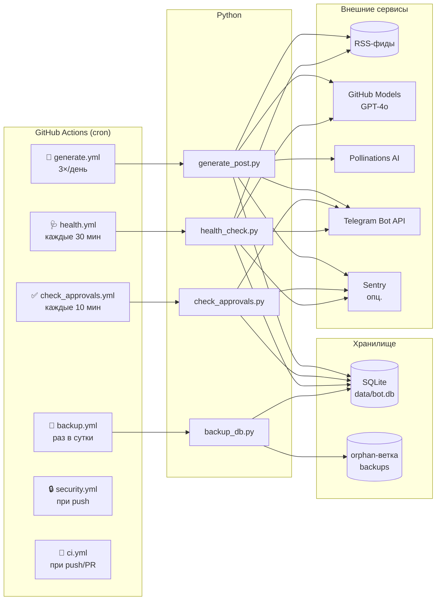
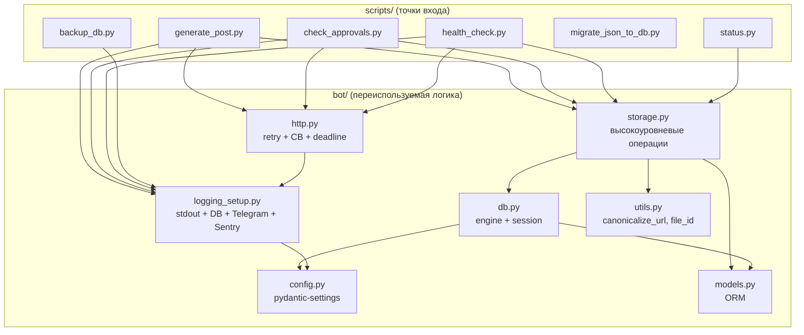
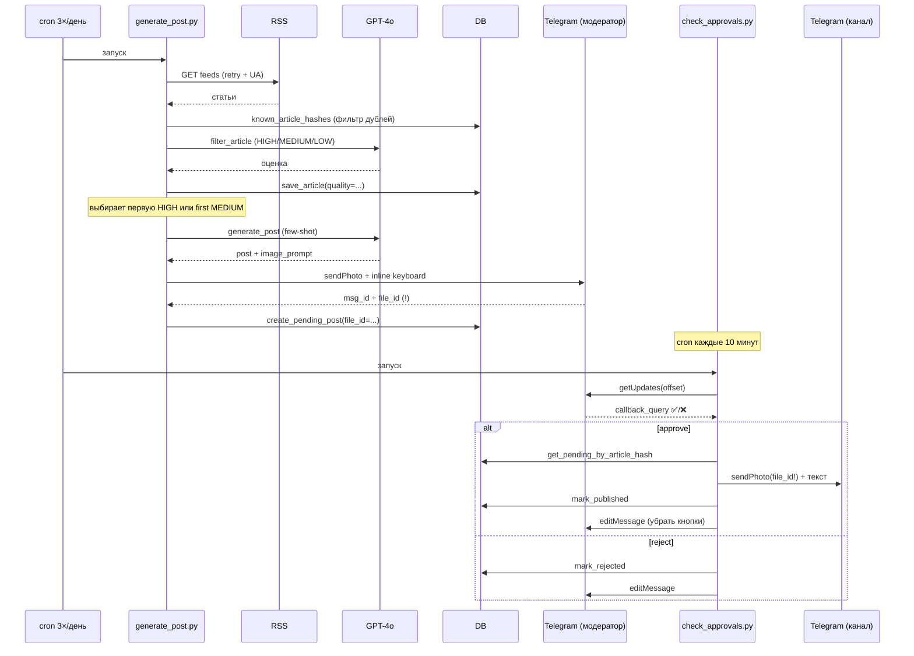
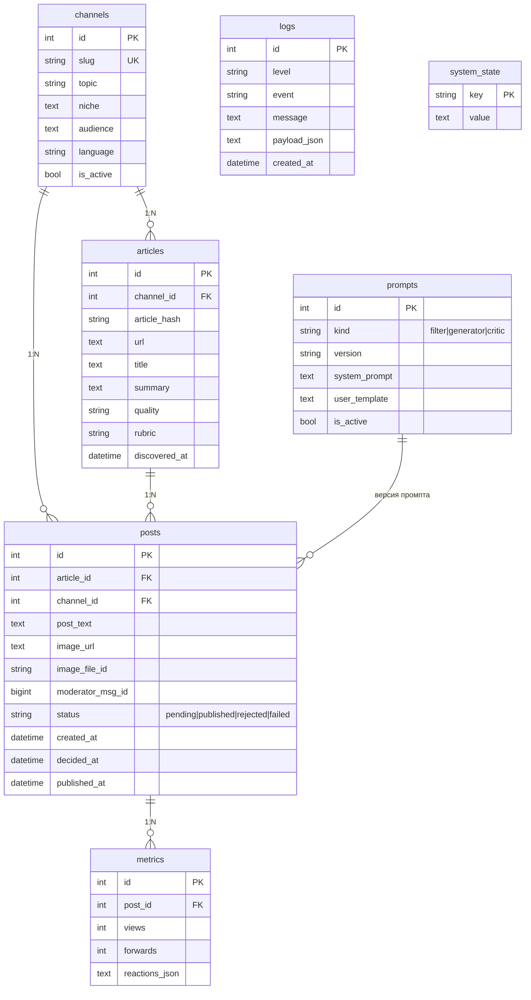

# ARCHITECTURE.md — Архитектура «Нейро-Новости Бот»

Документ для нового разработчика / форка: что из чего состоит, как данные текут, где точки отказа.

---

## 🎯 Назначение системы

Автоматизированная сеть Telegram-каналов. На каждый канал — отдельный fork репозитория с теми же скриптами, но разной конфигурацией (`CHANNEL_TOPIC`, `RSS_FEEDS`, …). Бот:

1. Парсит RSS
2. Оценивает каждую статью (`HIGH/MEDIUM/LOW`) через GPT-4o
3. Генерирует SMM-пост с few-shot обучением + картинку
4. Отправляет модератору с кнопками ✅ / ❌
5. После одобрения публикует в канал

---

## 🗺 Высокоуровневая схема



---

## 🧱 Слои кода



**Правило слоёв:**
- `scripts/*.py` — оркестрация. Никакого SQL.
- `bot/*.py` — переиспользуемая логика. Не должна знать о Telegram-специфике.
- Скрипты НЕ ходят в ORM напрямую — только через `bot.storage`.

---

## 🌊 Жизненный цикл поста



**Ключевые гарантии:**
- Картинка идёт по **Telegram file_id**, а не URL. Если Pollinations лежит — пост всё равно опубликуется (см. T1.5).
- URL-канонизация: одна статья = один hash, даже с разными UTM-метками (см. `bot.utils.canonicalize_url`).
- Retry + circuit breaker: на любые сетевые сбои; общий дедлайн 5 минут на пайплайн (см. `bot/http.py`).

---

## 🗃 Схема БД



7 таблиц + `alembic_version` (служебная). Миграции — через Alembic, см. [RECOVERY.md](RECOVERY.md).

---

## 🩺 Точки отказа и компенсации

| Точка | Что может сломаться | Что мы делаем |
|-------|---------------------|---------------|
| GitHub Models | Rate limit / 5xx | `bot.http` ретраит с backoff; fallback на gpt-4o-mini |
| Pollinations AI | Картинка не сгенерилась | Retry; если совсем нет — пост идёт текстом |
| Telegram API | Сеть / лимиты | Retry + circuit breaker (5 ошибок → 5 мин блок) |
| RSS-сервер | Недоступен | Skip этого фида; health-check алертит если упало ≥50% |
| БД | Файл повреждён | Бэкап из orphan-ветки `backups` (см. RECOVERY.md) |
| Долго висящий pending | Модератор не нажал кнопку | health-check каждые 30 мин чистит >48ч → `FAILED` |
| Утечка секретов в коммит | — | gitleaks + GitHub secret-scanning + pre-commit detect-private-key |
| Уязвимость в зависимостях | — | pip-audit + Dependabot weekly |

---

## 🔁 Workflow-cron'ы

| Workflow | Расписание | Concurrency group | Что делает |
|----------|------------|-------------------|------------|
| `generate.yml` | `0 7,13,19 * * *` | `data-write` | Генерация поста |
| `check_approvals.yml` | `*/10 * * * *` | `data-write` | Публикация после одобрения |
| `health.yml` | `*/30 * * * *` | `data-write` | Самопроверка + cleanup |
| `backup.yml` | `30 3 * * *` | `backup` | Снимок БД в orphan-ветку |
| `ci.yml` | при push/PR | `ci-{ref}` | Lint + types + tests |
| `security.yml` | при push + еженедельно | (нет) | gitleaks + pip-audit |

**Concurrency `data-write`** общая у трёх первых — потому что все три пишут в `data/bot.db` и одновременный коммит сломал бы git.

---

## 🌐 Масштабирование на сеть каналов

Текущая архитектура — **per-channel SQLite в репо**. Для 1–15 каналов работает идеально (один файл БД на канал, нет внешних зависимостей).

Для 15+ каналов планируется (Стадия 3):
- Миграция на **Supabase Postgres** (one DB, multi-tenant по `channel_id`)
- Веб-админка модерации вместо личных сообщений
- Единый дашборд метрик
- Cross-posting между каналами

Сейчас замена БД-движка делается **одной env-переменной**:
```
DB_URL=postgresql://...
```

Потому что `bot.storage` ничего не знает о конкретной СУБД, а `bot.config` берёт URL из окружения. SQLAlchemy + Alembic поддерживают обе.

---

## 📦 Зависимости (production)

| Пакет | Версия | Назначение |
|-------|--------|-----------|
| `feedparser` | ≥6.0.11 | Парсинг RSS |
| `requests` | ≥2.32.0 | HTTP (через `bot.http`) |
| `SQLAlchemy` | ≥2.0.30 | ORM, нативный 2.0-стиль |
| `alembic` | ≥1.13.0 | Миграции БД |
| `pydantic` | ≥2.7.0 | Валидация конфига |
| `pydantic-settings` | ≥2.3.0 | env → объект Settings |
| `sentry-sdk` | ≥2.10.0 | Опциональная агрегация ошибок |
| `tenacity` | ≥8.5.0 | Retry с exponential backoff |

Dev-зависимости (для CI и pre-commit): `pytest`, `pytest-cov`, `ruff`, `black`, `mypy`, `types-requests`.

---

## 📍 Где что лежит

```
.
├── bot/                    переиспользуемая логика
│   ├── config.py           pydantic-settings: валидация env
│   ├── models.py           ORM-схема (7 таблиц)
│   ├── db.py               engine, session_scope, init_db с auto-alembic-stamp
│   ├── storage.py          высокоуровневые операции (save_article и т.д.)
│   ├── http.py             retry + circuit breaker + deadline (tenacity)
│   ├── logging_setup.py    stdout + БД + Telegram-alert + Sentry
│   └── utils.py            canonicalize_url, best_telegram_file_id
├── scripts/                точки входа (запускаются cron'ом)
│   ├── generate_post.py    основной генератор постов
│   ├── check_approvals.py  публикация после одобрения
│   ├── health_check.py     самопроверка + cleanup
│   ├── backup_db.py        снимок БД
│   ├── migrate_json_to_db.py одноразовая миграция со старой версии
│   └── status.py           CLI для просмотра состояния
├── migrations/             Alembic-миграции
├── tests/                  pytest (66 тестов, core coverage ~88%)
├── data/
│   └── bot.db              SQLite, единственное файловое состояние
├── .github/
│   ├── workflows/          generate, check, health, backup, ci, security
│   ├── dependabot.yml      weekly auto-PR с обновлениями
│   └── gitleaks.toml       allowlist для .env.example
├── alembic.ini             Alembic-конфиг
├── pyproject.toml          black/ruff/mypy/pytest
├── .pre-commit-config.yaml локальные pre-commit hooks
├── requirements.txt        production-зависимости
├── .env.example            шаблон env-переменных для local dev
├── ROADMAP.md              план 4 стадий
├── PROGRESS.md             чеклист 43 задач
├── AUDIT.md                аудит исходного кода
├── ARCHITECTURE.md         этот файл
├── SECURITY.md             политика безопасности
└── RECOVERY.md             восстановление БД + Alembic
```

---

## 🚀 Запуск с нуля (новый канал)

1. Форк репозитория → новое имя.
2. GitHub → Settings → Secrets: добавить `TELEGRAM_BOT_TOKEN`, `TELEGRAM_MODERATOR_ID`, `TELEGRAM_CHANNEL_ID`, `GH_MODELS_TOKEN`.
3. (Опционально) GitHub → Settings → Variables: задать `CHANNEL_TOPIC`, `CHANNEL_NICHE`, `CHANNEL_AUDIENCE`, `RSS_FEEDS`.
4. Actions → **«📝 Генерация поста»** → Run workflow.
5. Первый запуск создаст пустую БД через `init_db()` + `alembic stamp head`.
6. Готово.

Для локальной разработки: `cp .env.example .env`, заполнить, `pip install -r requirements.txt`, `python scripts/status.py`.
